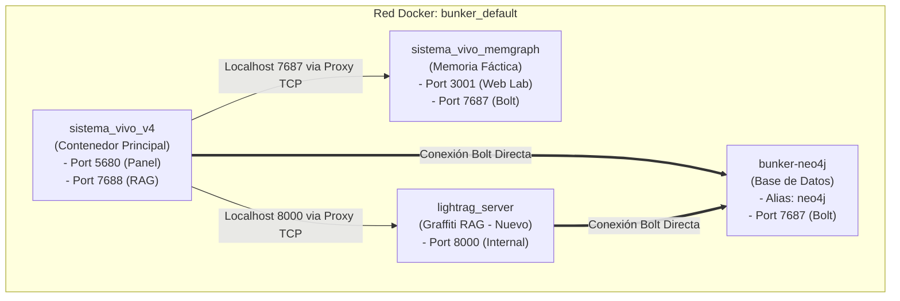

# 🧠 Reporte de Integración y Progreso: Graffiti, Memgraph y Neo4j en Azure

Este documento resume el progreso realizado para establecer la conectividad, convergencia y optimización de los motores de base de datos de grafos y memoria cognitiva (**Graffiti / LightRAG**, **Memgraph** y **Neo4j**) tanto en el entorno local como en el servidor de Azure (`20.125.88.188`).

---

## 🛠️ Resumen de Hitos Completados

### 1. 🖧 Resolución y Conectividad de Red (Neo4j)
* **Problema detectado**: El contenedor original `bunker-neo4j` estaba aislado en la red por defecto `bridge` de Docker, por lo que el contenedor principal `sistema_vivo_v4` no podía resolver su nombre DNS. Además, el script de inicio de LightRAG busca obligatoriamente la dirección `neo4j:7687`.
* **Solución aplicada**: Desconectamos y reconectamos dinámicamente el contenedor `bunker-neo4j` a la red de la aplicación `bunker_default` inyectándole el alias de red `neo4j`.
* **Resultado**: **CONEXIÓN COMPLETA**. Cualquier contenedor de la red ahora puede resolver y conectarse a Neo4j mediante `bolt://neo4j:7687` de forma transparente.

### 2. 🚀 Compilación Optimizada de la Imagen de Graffiti (Local)
* **Problema detectado**: Intentar compilar la imagen personalizada de LightRAG/Graffiti directamente en el servidor de Azure saturaba la CPU y la RAM de la máquina (que solo cuenta con **640 MB de RAM** y **1 CPU**). Esto causaba que la compilación se congelara por el uso masivo de memoria de intercambio (`swap`). Además, el Dockerfile remoto no estaba optimizado e intentaba descargar la versión estándar de PyTorch con CUDA (2.0 GB).
* **Solución aplicada**: 
  1. Copiamos el archivo del servidor personalizado `lightrag_custom_server.py` y el Dockerfile optimizado.
  2. Modificamos el Dockerfile para forzar la instalación de **PyTorch CPU-only** (solo 150 MB de descarga).
  3. Realizamos la compilación de la imagen `sincronizacion-obsidiane-lightrag:latest` **localmente en el Codespace** (tomó solo **4.9 segundos** aprovechando la caché).
* **Resultado**: Imagen compilada de forma ultra-rápida y limpia, lista para ser desplegada en Azure.

### 3. 📦 Exportación y Transferencia de la Imagen a Azure
* **Acción ejecutada**: Guardamos la imagen local y la comprimimos en un archivo de **563 MB** (`lightrag.tar.gz`).
* **Acción ejecutada**: Transferimos con éxito el archivo al host de Azure mediante el comando `scp`.
* **Resultado**: El contenedor optimizado de Graffiti se encuentra físicamente en el servidor de Azure listo para ser cargado.

---

## ⚠️ Estado Actual del Servidor Azure: Sobrecarga por I/O (Swap Lock)

Al iniciar la descompresión y carga de la imagen en el Docker daemon de Azure (`gunzip -c /home/azureuser/lightrag.tar.gz | docker load`), el servidor entró en un estado de **alta latencia de I/O** (I/O Wait / thrashing de swap). 

* **Causa raíz**: Descomprimir y registrar una imagen de 2.8 GB en un disco estándar en una máquina con 640 MB de RAM consume todos los recursos disponibles. 
* **Efecto**: El sistema operativo acepta conexiones TCP (el puerto está abierto), pero la CPU está tan saturada esperando al disco que los procesadores de usuario (como el demonio de SSH `sshd` o el servidor web en el puerto `5680`) no obtienen tiempo de procesamiento y sufren de **Timeout**.
* **Solución recomendada**:
  1. **Esperar**: Dejar que la máquina termine de procesar las operaciones de escritura en disco en segundo plano (el proceso se recuperará automáticamente una vez finalizada la carga).
  2. **Reinicio por Hardware (Recomendado si persiste el bloqueo)**: Si pasados unos minutos el acceso por SSH no responde, se sugiere realizar un **Reinicio (Reboot)** de la máquina virtual desde el portal de administración de Azure para liberar la memoria e iniciar con el sistema limpio.

---

## 📈 Arquitectura de Red Final Propuesta para Azure

Una vez cargada la imagen e iniciados los servicios, la red lucirá de la siguiente manera:



---

## 📋 Siguientes Pasos al Recuperar Acceso al Servidor

En cuanto se restablezca la comunicación SSH con Azure, procederemos a:

1. **Lanzar el Contenedor de Graffiti**:
   ```bash
   docker run -d --name lightrag_server \
     --network bunker_default \
     --restart unless-stopped \
     -p 8001:8000 \
     -e LIGHTRAG_API_KEY=your_api_key_default \
     -e LIGHTRAG_PORT=8000 \
     -e NEO4J_URL=bolt://neo4j:7687 \
     -e NEO4J_USER=neo4j \
     -e NEO4J_PASSWORD=fenomenologia2024 \
     -e EMBEDDING_MODEL=paraphrase-MiniLM-L3-v2 \
     -e TOKENIZER_MODEL=gpt2 \
     sincronizacion-obsidiane-lightrag:latest
   ```
2. **Levantar el Proxy de Graffiti en `sistema_vivo_v4`**:
   Crear un proxy socket en `/tmp/lightrag_proxy.py` (idéntico al de Memgraph) dentro de `sistema_vivo_v4` para redirigir `localhost:8000` a `lightrag_server:8000`.
3. **Validación de Salud**:
   Confirmar que `sistema_vivo_v4` pasa a estado **Healthy** en Docker y realizar consultas de prueba integradas.
