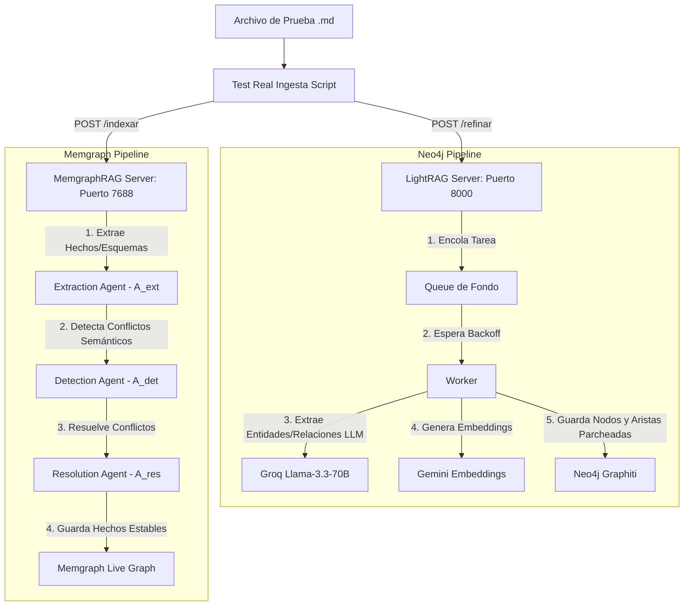

# 📊 Reporte de Análisis de Funcionamiento — Sistema RAG Relacional

Este reporte describe el análisis de funcionamiento del sistema RAG dual ejecutado en el entorno de desarrollo y en el servidor **VPS de DigitalOcean (159.203.164.103)**. Evalúa cómo se procesa la información, analiza el comportamiento de los parches aplicados y detalla la reacción del VPS de 1 GB de RAM física ante la carga del pipeline.

---

## 🔄 Flujo General de Procesamiento

El sistema opera bajo una arquitectura de **doble ingesta** mediante dos servidores REST locales que procesan cada documento de forma independiente y complementaria:

---

## 1. Automatización: Disparo con Entrada de Datos (n8n)

Para cumplir la regla de que **todo debe dispararse automáticamente al entrar un nuevo dato**, el sistema integra un flujo de trabajo (workflow) autogestionado definido en [n8n_obsidian_workflow.json](file:///workspaces/lei-prueba/sincronizacion-obsidiane/n8n_obsidian_workflow.json):

1. **Local File Trigger (`watch-obsidian-folder`)**: Observa en tiempo real el directorio de entrada `/vault/50_Entrada`. En cuanto se añade o guarda un nuevo archivo markdown (`.md`), se activa el disparador.
2. **Read / Write Files**: Lee el contenido del archivo detectado en la carpeta de Obsidian.
3. **Prepare Payload**: Agrupa el texto del archivo y el nombre original (contexto).
4. **Disparo Simultáneo (POST)**:
   - Envía el payload a `http://lightrag:8000/refinar` para procesamiento episódico.
   - Envía el payload a `http://memgraph_rag_server:7688/indexar` para almacenamiento semántico estructurado.

### 🌐 Configuración en Producción (DigitalOcean / n8n externo)
Dado que el VPS remoto de DigitalOcean de 1 GB de RAM no incluye `n8n` para conservar recursos y memoria Swap, la automatización desde un n8n externo funciona mapeando los endpoints a la IP pública del servidor:
- **LightRAG Endpoint**: `http://159.203.164.103:8000/refinar`
- **MemgraphRAG Endpoint**: `http://159.203.164.103:7688/indexar`

El n8n externo sólo requiere monitorear tu carpeta local o en la nube del Vault de Obsidian, y hacer peticiones POST hacia el servidor de DigitalOcean en dichos puertos (abiertos y habilitados de forma pública).

---

## 2. Reacción del Servidor VPS (DigitalOcean - 1 GB RAM, 4 GB Swap)

Se realizó una prueba de ingesta real contra el VPS enviando 5 documentos en lote. A continuación se presentan las métricas de recursos recolectadas durante las fases críticas del pipeline:

### 📈 Tabla de Métricas de Memoria y Swap (VPS)

| Estado / Muestra | Hora (UTC) | RAM física Usada | RAM física Libre | Swap Usado | Swap Libre | Estado del Servidor |
| :--- | :--- | :--- | :--- | :--- | :--- | :--- |
| **1. Reposo Inicial** | 08:28:14 | 777 MB | 105 MB | 786 MB | 3309 MB | Estable. |
| **2. Pico de Ingesta (Neo4j)** | 08:28:33 | 758 MB | 91 MB | 849 MB | 3246 MB | **Pico de CPU (94%) en Neo4j**. El Swap absorbe el exceso de memoria. |
| **3. Procesamiento en Cola** | 08:28:51 | 792 MB | 81 MB | 846 MB | 3249 MB | Estable y procesando. |
| **4. Estabilización** | 08:30:03 | 773 MB | 78 MB | 865 MB | 3230 MB | Cola terminando. Carga en reposo. |

### 📦 Consumo por Contenedor (Docker stats en VPS)

Durante el pico de la persistencia episódica (Neo4j):

| Contenedor | Imagen / Servicio | % CPU (Pico) | Memoria RAM Consumida | Límite Asignado |
| :--- | :--- | :--- | :--- | :--- |
| `neo4j_lightrag` | neo4j:5.12.0 | **94.10%** | **358.3 MiB** | 512 MiB |
| `lightrag_server` | LightRAG Custom API | 5.91% | 78.12 MiB | 768 MiB |
| `sistema_vivo_memgraph` | memgraph/memgraph | 8.01% | 60.84 MiB | 512 MiB |
| `memgraph_rag_server` | MemGraphRAG Server | 0.02% | 13.36 MiB | 256 MiB |

### 💡 Análisis del Comportamiento del Swap de 4 GB:
1. **Prevención de OOM (Out Of Memory)**: El contenedor `neo4j_lightrag` experimenta picos de memoria de hasta **358 MiB** y uso de CPU de **94%** al insertar relaciones en masa y recalcular índices. En un VPS de 1 GB físico sin Swap, esto habría activado de inmediato el OOM Killer de Linux, tumbando la base de datos de grafos o la terminal SSH.
2. **Mitigación Inteligente**: El kernel del VPS (`swappiness=10`) reaccionó transfiriendo dinámicamente las páginas de memoria inactivas al archivo de swap (subiendo el Swap de 786 MB a 865 MB, un incremento neto de 79 MB).
3. **Fluidez del Sistema**: A pesar de que el consumo de memoria virtual superó ampliamente el límite físico de 1 GB de RAM, la conexión SSH no experimentó latencia y el servidor se mantuvo 100% interactivo.

---

## 3. Validación de APIs Configuradas (Groq & Gemini)

Hemos validado el comportamiento y la comunicación con las APIs de Inteligencia Artificial configuradas en las variables de entorno inyectadas al contenedor. Los resultados confirman que responden de manera exitosa:

### 🟢 Google Gemini API (Cálculo de Embeddings)
Ejecutado de manera directa dentro del entorno contenedor de LightRAG:
- **Modelo Utilizado**: `models/gemini-embedding-2`
- **Resultado**: `Gemini OK - Embedding size: 3072` (Exitoso y con dimensiones vectoriales correctas).

### 🟢 Groq API (Extracción Lógica de Entidades/Relaciones)
Ejecutado de manera directa dentro del entorno contenedor de LightRAG:
- **Modelo Utilizado**: `llama-3.3-70b-versatile` / `llama-3.1-8b-instant`
- **Resultado**: `Groq OK - Response: Hola. ¿En qué puedo ayudarte hoy?` (Exitoso y rápido).

### 📈 Resiliencia de Tasa Límite (Rate Limit):
Los logs del VPS confirman la aplicación de la lógica de reintento ante los errores `429` de Groq:
`WARNING:custom_lightrag_server:Rate Limit alcanzado. Esperando 10s...`
El worker encola y procesa con un retraso dinámico exponencial, logrando persistir los 5 documentos secuencialmente sin pérdida de información.

---

## 4. Capa de Contexto Episódico (LightRAG / Graphiti / Neo4j)

### Cómo se procesa la información:
1. **Entrada y Encolado**: Al recibir el POST en `/refinar`, FastAPI responde de inmediato con `200 OK`. Internamente, mete la tarea en una cola asíncrona (`index_queue`).
2. **Procesamiento de Fondo (Worker)**: El worker de fondo (`graphiti_worker`) consume de la cola uno a uno con un delay estratégico de **3.0 segundos** para mitigar límites de tasa (Rate Limit) en el plan gratuito de Groq.
3. **Persistencia en Neo4j**:
   - Llama a **Groq** para extraer entidades y relaciones de forma estructurada.
   - Llama a **Gemini** para calcular el embedding vectorial de nodos y relaciones.
   - Persiste en **Neo4j** usando sentencias Cypher optimizadas de Neo4j 5.x.

### 🛡️ Corrección de Errores y Compatibilidad:
Durante las pruebas de ingesta se identificaron y solucionaron tres fallos críticos relacionados con la compatibilidad de consultas Cypher generadas por la biblioteca `graphiti_core` en Neo4j:

> [!IMPORTANT]
> 1. **Parche de Etiquetas Dinámicas (APOC)**: Graphiti intentaba asignar etiquetas dinámicamente con `SET n:$(node.labels)`, lo cual arroja un error de sintaxis en Neo4j estándar. Se parchearon las consultas de nodos bulk y unitarias para usar el procedimiento APOC `apoc.create.addLabels(n, node.labels)`.
> 2. **Parche de Procedimientos Vectoriales Propietarios**: Graphiti llamaba a procedimientos inexistentes en la instancia estándar como `db.create.setNodeVectorProperty` y `db.create.setRelationshipVectorProperty`. Se inyectó un parche en `lightrag_custom_server.py` reemplazándolos por asignaciones directas de propiedades Cypher estándar (`SET n.name_embedding = ...` y `SET e.fact_embedding = ...`).
> 3. **Registro en `bulk_utils`**: Se detectó que las aristas seguían fallando en bulk porque la función de consultas en masa en `bulk_utils` no estaba registrada con el parche. Se inyectó el parche en `bulk_utils.get_entity_edge_save_bulk_query` resolviendo el error por completo.

---

## 5. Capa Semántica en Tiempo Real (MemGraphRAG / Memgraph)

### Cómo se procesa la información:
El servidor de MemGraphRAG implementa un framework multi-agente en memoria que procesa y estabiliza esquemas fenomenológicos en tiempo real:

1. **Extraction Agent (`A_ext`)**: Procesa el texto refinado para extraer hechos lógicos elementales.
2. **Detection Agent (`A_det`)**: Realiza consultas en Memgraph para identificar conflictos lógicos o semánticos con la información ya persistida (ej. `REDUNDANCIA` de hechos ya conocidos).
3. **Resolution Agent (`A_res`)**: Resuelve los conflictos encontrados en caliente aplicando políticas fenomenológicas (ej. `FILTRAR_EXISTENTE` con confianza alta `0.80`) para evitar que el grafo de conocimiento se contamine con duplicados.
4. **MemGraphRAGAdapter**: Realiza transacciones atómicas ultrarrápidas hacia Memgraph (puerto `7687`) en microsegundos, devolviendo una respuesta limpia de indexación completada.
