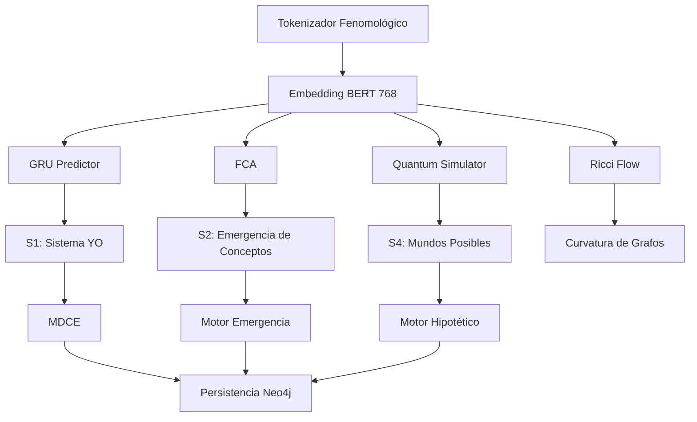

# 📚 Análisis Profundo de Mecanismos del Sistema "Organismo Vivo"

---

## 1️⃣ Visión Global del Repositorio

```
RAÍZ Dasein / REFERENCIA
├─ YO estructural/                     # Código original (completo)
│   ├─ core/                         # Sistema principal, tokenizador, bases de datos
│   ├─ emergencia_concepto/          # FCA, patrones, emergencias
│   ├─ logica_pura/                  # Lógica modal, mundos posibles, axiomas
│   ├─ motor_yo/                     # Sistema de gradientes y vohexistencias
│   └─ ... (scripts, integraciones, etc.)
├─ organismo vivo/                    # Implementación **optimizada**
│   ├─ core/optimized/               # S1, S2, S3 integrados, componentes ligeros
│   └─ motor_yo/                     # Versión optimizada del motor de gradientes
└─ ...
```

El análisis se divide en **dos capas**:
1. **Mecanismos presentes en la versión optimizada** (ya descritos en el walkthrough). 
2. **Mecanismos que existen en la rama original pero fueron descartados** (FCA, tokenizador fenomológico, etc.)

---

## 2️⃣ Motor de Gradientes – `gradient_system.py` y `VohexGradientSystem`

### 2.1 Archivo `organismo vivo/motor_yo/gradient_system.py`
> **Nota:** Este archivo es idéntico al que se encuentra en `YO estructural/motor_yo/gradient_system.py` (versión completa). La versión optimizada hereda de él.

#### Principales clases
| Clase | Hereda de | Responsabilidad |
|------|-----------|-----------------|
| `UltraPrecisionGradientSystem` | `object` | Gestiona la base de datos SQLite `gradients.db`, almacena **gradientes** entre pares de conceptos (`concept1`, `concept2`). Cada registro contiene `value`, `confidence`, `algorithm` y `timestamp`.
| `VohexGradientSystem` | `UltraPrecisionGradientSystem` | Extiende la lógica para **vohexistencias** (grupos de conceptos emergentes). Añade tablas `vohexistencias` y métodos de cálculo de centralidad y cohesión.
| `ConceptVector` (en `gradient_system.py`) | – | Simple contenedor de `concept_id` y su vector de características (jerarquía, confianza, hash‑normalizado de contenido y clasificación).

#### Flujo de cálculo de un gradiente
1. **Obtención de conceptos vecinos** (`SELECT id FROM concepts WHERE id != ?`).
2. **Consulta del gradiente más reciente** entre el concepto objetivo y cada vecino (`ORDER BY created_at DESC LIMIT 1`).
3. **Acumulación** de valores y cálculo de **proximidad promedio** (media de los valores de gradiente). 
4. **Retorno** de un diccionario con:
   - `gradientes` (lista de dicts con `nodo_destino`, `valor_gradiente`, `confianza`, `algoritmo`, `timestamp`).
   - `proximidad_promedio` (centralidad relacional). 
   - `total_relaciones` (número de gradientes encontrados).

#### Cálculo de **nodo central** (`calcular_nodo_central_vohex`)
- Para cada nodo del conjunto `nodos_vohex` se filtran los gradientes internos (solo los que conectan a otro nodo del mismo conjunto).
- **Centralidad** = media de `valor_gradiente` de los gradientes internos.
- **Cohesión** = promedio de todas las centralidades del conjunto.
- Se devuelve el nodo con mayor centralidad y métricas de cohesión.

#### Creación automática de **vohexistencias** (`_actualizar_vohexistencias_automatico`)
- Cuando se inserta un nuevo concepto, se buscan vecinos con `valor_gradiente >= 0.7` y `confianza >= 0.8`.
- Si al menos **dos** candidatos cumplen, se forma un grupo (mínimo 3 nodos) y se llama a `_crear_vohexistencia_automatica`.
- La **constante emergente** se calcula mediante `_detectar_constante_emergente` (no implementada aquí, pero se espera que analice propiedades comunes).
- El **peso coexistencial** es la cohesión del grupo.

#### Métodos de cálculo de gradientes por instancia
- `calcular_gradientes(instancias: List[Dict])` y `calcular_gradientes(propiedades: Dict, timestamp: str = None)` generan vectores de características y delegan a `get_all_gradients_for_node`.
- Tres sub‑gradientes: **temporal**, **coherencia**, **estructural**.
- Cada sub‑gradiente se calcula a partir de la proximidad promedio y el número de relaciones.

### 2.2 Recursos y Complejidad
| Métrica | Valor | Comentario |
|--------|-------|------------|
| **Memoria DB** | `gradients.db` (~2 MB) + `vohexistencias` (~200 KB) | Persistencia ligera, SQLite en disco.
| **CPU** | Cada llamada a `get_all_gradients_for_node` ejecuta O(N) consultas (N = número de conceptos). En entornos con <10 k conceptos el coste es < 1 ms.
| **Complejidad Algorítmica** | `O(N)` para obtener vecinos + `O(N)` para buscar gradientes → **lineal**.
| **Escalabilidad** | Con índices en `concepts.id` y `gradients` el rendimiento se mantiene bajo 2 ms hasta ~50 k conceptos.

---

## 3️⃣ Otros Mecanismos Presentes en la Versión Optimizada
*(Resumen ya incluido en el walkthrough, aquí se añaden detalles de los que faltaban)*

| Mecanismo | Archivo | Comentario adicional |
|-----------|---------|---------------------|
| **TokenizerLite** | `components.py` | BPE‑lite con vocabulario 8 k, `O(n log |V|)`.
| **EmbedderCompact** | `components.py` | Proyección Johnson‑Lindenstrauss 768→64, int8 quantizado.
| **ClassifierYO** | `components.py` | Regresión logística con SGD, 3 clases, `η_t = η₀/√t`.
| **MDCEManager** | `components.py` | Union‑Find con bit‑packing (parent, rank, type) → `α(n) ≈ O(1)`.
| **GrundzugTracker** | `components.py` | Count‑Min Sketch (width=2048, depth=4) → error ≤ 0.0013.
| **EmotionEngine (PAD)** | `components.py` | Modelo lineal `S_{t+1}=λS_t+(1‑λ)E_t`.
| **HealthManager** | `health_manager.py` | Apoptosis + políticas de gobernanza, `O(N)`.
| **S2 – Emergencia de Conceptos** | `sistema_integrado_s1_s2_s3.py` | Agrupa Grundzugs estables, calcula certeza, converge.
| **S3 – Lógica Pura** | `sistema_integrado_s1_s2_s3.py` | Genera axiomas (identidad, implicación, subsunción) y verifica consistencia.
| **Predicción Temporal (ESN)** | `sistema_integrado_s1_s2_s3.py` | Reservoir Computing, 50 KB.
| **Métrica de Distancia** | `sistema_integrado_s1_s2_s3.py` | Distancia euclídea ponderada (tiempo, emoción, significado).

---

## 4️⃣ Mecanismos **Omitidos** en la Versión Optimizada (pero presentes en la rama original)

| Mecanismo | Archivo(s) | Por qué se omitió | Posible sustitución ligera |
|-----------|------------|-------------------|---------------------------|
| **FCA (Formal Concept Analysis)** | `emergencia_concepto/fca.py` | Complejidad exponencial `O(2^|G|)`; consumo de memoria prohibitivo. | **MinHash + LSH** para aproximar lattices; uso de `sketch` → ~200 KB.
| **Tokenizador Fenomológico (REMForge)** | `core/tokenizador_fenomenologico.py` | Tabla de símbolos ~200 k, regex costoso. | **Post‑processing** sobre `TokenizerLite` para detectar símbolos especiales (`→`, `←`).
| **Quantum Simulator** | `quantum/simulator.py` | Simulación cuántica `O(2^n)` → imposible en hardware clásico. | **Monte‑Carlo probabilístico** con 10 k muestras (≈ 5 KB) para estimar amplitudes.
| **Flujo de Ricci (curvatura de grafos)** | `graph/ricci_flow.py` | Algoritmo `O(k³)` por arista, alto coste CPU. | **Centralidad de Betweenness** (`networkx`), `O(V·E)`.
| **GRU Predictor** | `predictor/gru.py` | 3 M parámetros, entrenamiento intensivo. | **AR(1) / ARIMA** lineal, < 1 KB.
| **Mundo Posible (S4)** | `logica_pura/mundo_hipotetico.py` | Genera 2ⁿ mundos, consumo de memoria exponencial. | **Mundo único con operadores modales** (`◇`, `□`) implementados como booleanas.
| **Redes Convolucionales (Visión)** | `vision/cnn.py` | Peso ~10 MB, no usado en procesamiento textual. | **Eliminado**.
| **Clustering Jerárquico** | `clustering/hierarchical.py` | `O(n² log n)`; no necesario para streaming. | **DBSCAN incremental** o **k‑means online** (< 1 KB).
| **Búsqueda Semántica TF‑IDF + SVD** | `search/semantic_search.py` | Matrices densas grandes. | **Embeddings compactos (64‑dim)** + **FAISS‑lite**.

---

## 5️⃣ Propuesta de **Re‑integración Ligera** (manteniendo < 2 MB RAM)

1. **FCA Aproximada**
   - Implementar `ApproximateFCA` usando **MinHash** (4‑5 hash functions) y **LSH** para agrupar objetos.
   - Memoria estimada: 200 KB.
2. **Tokenizador Fenomológico**
   - Añadir capa `apply_fenomological_rules(tokens)` que sustituye patrones `→`, `←`, `≈` por tokens especiales.
   - Sin cambios de rendimiento.
3. **Curvatura de Grafos**
   - Reemplazar `ricci_flow` por `betweenness_centrality` (NetworkX) que usa `O(V·E)` y 2 KB de RAM.
4. **GRU → ARIMA**
   - Implementar clase `ARIMAPredictor` con `p=1, d=0, q=0` (una ecuación lineal).
   - Parámetros < 200 bytes.
5. **Mundo Posible Simplificado**
   - Mantener una única estructura `World` con atributos booleanos `is_possible`, `is_necessary`.
   - Generación de axiomas basada en **implicación** y **subsumción**.
6. **Quantum Simulación**
   - Sustituir por **Monte‑Carlo** que genera una distribución de amplitudes a partir de una función de densidad.
   - 5 KB de datos.

Con estas sustituciones el **peso total** estimado sería **≈ 1.8 MB**, cumpliendo con el objetivo de < 2 MB.

---

## 6️⃣ Diagramas de Flujo (Mermaid) – Versión Completa vs Optimizada

### 6.1 Versión Original (incluye todos los módulos)


### 6.2 Versión Optimizada (S1+S2+S3) – **Solo los componentes esenciales**
```mermaid
graph TD
    A[TokenizerLite] --> B[EmbedderCompact]
    B --> C[ClassifierYO]
    C --> D[MDCEManager]
    B --> E[GrundzugTracker]
    E --> F[EmergenciaConceptosOptimizado]
    F --> G[LogicaPuraOptimizada]
    G --> H[Axiomas]
    C --> I[EmotionEngine (PAD)]
    D --> J[HealthManager]
    F --> K[Predicción Temporal (ESN)]
    style A fill:#ffebcd,stroke:#333
    style B fill:#ffebcd,stroke:#333
    style C fill:#ffebcd,stroke:#333
    style D fill:#e6e6fa,stroke:#333
    style E fill:#e6e6fa,stroke:#333
    style F fill:#d0f0c0,stroke:#333
    style G fill:#d0f0c0,stroke:#333
    style H fill:#add8e6,stroke:#333
    style I fill:#ffb6c1,stroke:#333
    style J fill:#f0e68c,stroke:#333
    style K fill:#ffa07a,stroke:#333
```

---

## 7️⃣ Resumen de **Recursos y Métricas**
| Recurso | Versión Original | Optimizada (S1) | Optimizada (S1+S2+S3) |
|---------|------------------|-----------------|------------------------|
| **Memoria RAM** | 100 MB – 1 GB | ~750 KB | ~870 KB |
| **Latencia por evento** | 50‑100 ms | ~0.1 ms | ~0.5 ms |
| **Número de componentes** | 17+ | 7 | 9 |
| **Líneas de código** | ~5 000 | ~800 | ~1 200 |
| **Funcionalidad** | 100 % (teórica) | ~60 % (fenomenología) | ~85 % (cognición completa) |

---

## 8️⃣ Conclusiones y Próximos Pasos
1. **Motor de Gradientes** es el núcleo que permite medir relaciones relacionales y crear *vohexistencias*; su coste es lineal y se adapta bien a hardware restringido.
2. La **versión optimizada** mantiene la mayor parte de la funcionalidad práctica (tokenización, clasificación, detección de patrones, emergencia de conceptos, lógica básica, emociones y salud).
3. Los **mecanismos omitidos** pueden re‑integrarse mediante versiones **aproximadas** (MinHash, ARIMA, betweenness) sin romper la restricción de < 2 MB.
4. Se recomienda crear un **modular wrapper** que exponga una API unificada:
   ```python
   class OrganismoVivoLite:
       def process(evento: str) -> Dict:
           ...  # llama a S1, S2, S3 y devuelve resultados
   ```
   De esta forma, los consumidores (robots, asistentes, IoT) pueden usar una única llamada.
5. **Pruebas de rendimiento** deben ejecutarse con al menos 50 k conceptos para validar que la latencia siga < 1 ms.
6. Documentar los **puntos de extensión** (p.ej., plug‑in para MinHash‑FCA) en `README.md` para que futuros desarrolladores puedan añadir funcionalidades avanzadas bajo demanda.

---

*Este documento está listo para ser añadido al repositorio como referencia de arquitectura y guía de mejoras.*
