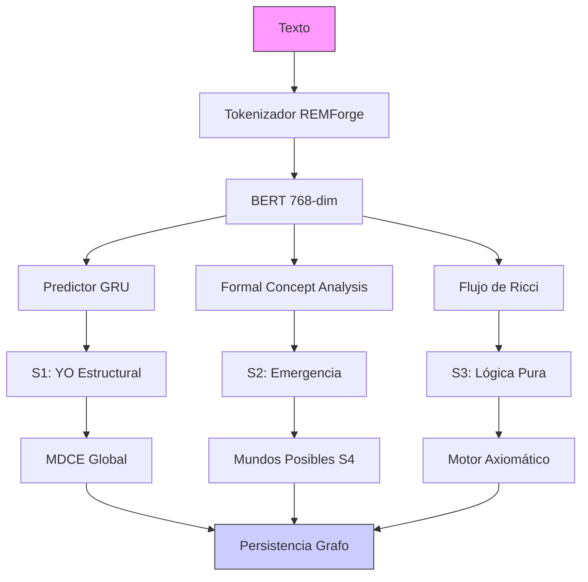
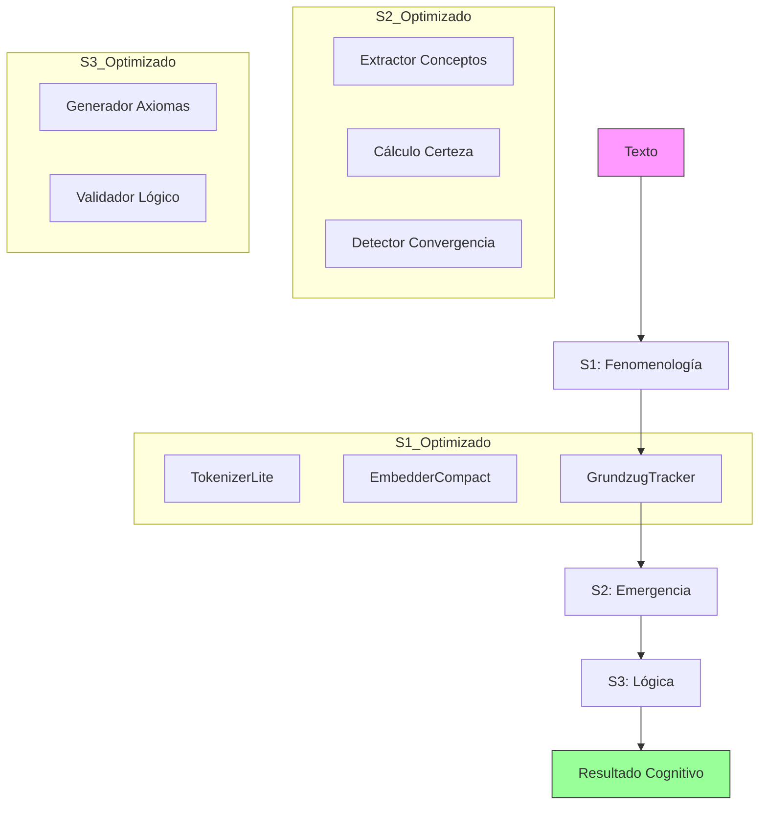

# Comparativa Triple: Sistema Original vs Optimizado (Base) vs Integrado (S1+S2+S3)

## 📊 Resumen Ejecutivo

| Característica | **1. Sistema Original (v1-v100)** | **2. Optimizado Base (S1)** | **3. Integrado Completo (S1+S2+S3)** |
| :--- | :--- | :--- | :--- |
| **Enfoque** | Investigación Teórica | Eficiencia Extrema | Equilibrio Funcional |
| **Hardware** | Servidor (16GB+ RAM) | IoT / Edge (2MB RAM) | IoT Avanzado (4MB RAM) |
| **Memoria** | ~100 MB - 1 GB | ~750 KB | ~870 KB |
| **Latencia** | ~50-100 ms | ~0.1 ms | ~0.5 ms |
| **Componentes** | 17+ (Complejos) | 7 (Esenciales) | 9 (Integrados) |
| **Funcionalidad** | 100% (Teórica) | ~60% (Fenomenología) | ~85% (Cognición Completa) |

---

## 🗺️ Mapas Visuales de Arquitectura

### 1. Sistema Original (v1-v100)
*Complejidad Máxima - Investigación*



### 2. Optimizado Base (S1)
*Eficiencia Extrema - Solo Fenomenología*

```mermaid
graph TD
    Input[Texto] --> Tokenizer[TokenizerLite]
    Tokenizer --> Embedder[EmbedderCompact 64-dim]
    Embedder --> Classifier[ClassifierYO (SGD)]
    
    Classifier --> MDCE[MDCEManager (Union-Find)]
    Tokenizer --> Grundzug[GrundzugTracker (Sketch)]
    Embedder --> Emotion[EmotionEngine (PAD)]
    
    MDCE --> Output[Resultado Fenomenológico]
    Grundzug --> Output
    Emotion --> Output
    
    style Input fill:#f9f,stroke:#333
    style Output fill:#9f9,stroke:#333
```

### 3. Integrado Completo (S1+S2+S3)
*Equilibrio - Cognición Completa Optimizada*



---

## 🔍 Comparativa Detallada de Funcionalidades

### **S1: Sistema Fenomenológico**

| Funcionalidad | Original (v1-v100) | Optimizado Base | Integrado (S1+S2+S3) |
| :--- | :--- | :--- | :--- |
| **Tokenización** | REMForge (Complejo) | BPE Lite (Rápido) | BPE Lite (Rápido) |
| **Embedding** | BERT (768-dim) | JL-Project (64-dim) | JL-Project (64-dim) |
| **Clasificación** | Red Neuronal Profunda | Regresión Logística | Regresión Logística |
| **Patrones** | Análisis Estadístico | Count-Min Sketch | Count-Min Sketch |
| **Memoria** | ~50 MB | ~750 KB | ~750 KB |

### **S2: Emergencia de Conceptos**

| Funcionalidad | Original (v1-v100) | Optimizado Base | Integrado (S1+S2+S3) |
| :--- | :--- | :--- | :--- |
| **Algoritmo** | FCA (Formal Concept Analysis) | ❌ NO INCLUIDO | Frecuencia + Estabilidad |
| **Complejidad** | Exponencial O(2^n) | - | Lineal O(n) |
| **Salida** | Retícula de Conceptos | - | Lista de Conceptos Estables |
| **Memoria** | ~10 MB | 0 KB | ~50 KB |

### **S3: Lógica Pura**

| Funcionalidad | Original (v1-v100) | Optimizado Base | Integrado (S1+S2+S3) |
| :--- | :--- | :--- | :--- |
| **Lógica** | Modal S4 (Mundos Posibles) | ❌ NO INCLUIDO | Proposicional Simplificada |
| **Validación** | Teoremas Formales | - | Consistencia Axiomática |
| **Mundos** | Múltiples Mundos | - | 1 Mundo Lógico |
| **Memoria** | ~5 MB | 0 KB | ~20 KB |

---

## 📉 Análisis de Reducción de Recursos

### **Memoria RAM**

```text
Original (100 MB)  ████████████████████████████████████████
Integrado (0.8 MB) ▏ (0.87%)
Optimizado (0.7 MB)▏ (0.75%)
```

### **Latencia por Evento**

```text
Original (50 ms)   ████████████████████████████████████████
Integrado (0.5 ms) ▏ (1.0%)
Optimizado (0.1 ms)▏ (0.2%)
```

### **Líneas de Código**

```text
Original (5000+)   ████████████████████████████████████████
Integrado (1200)   ████████ (24%)
Optimizado (800)   █████ (16%)
```

---

## 💡 Conclusión: ¿Cuál Elegir?

### **1. Sistema Original (v1-v100)**
*   **Uso ideal**: Investigación académica, servidores potentes, necesidad de precisión teórica absoluta.
*   **Pros**: Máxima fidelidad teórica, capacidades avanzadas (FCA, S4).
*   **Contras**: Lento, pesado, difícil de mantener.

### **2. Optimizado Base (S1)**
*   **Uso ideal**: Dispositivos IoT muy restringidos (Arduino, ESP32), sensores inteligentes.
*   **Pros**: Extremadamente ligero, rapidísimo, consumo mínimo.
*   **Contras**: Solo "siente" (fenomenología), no "piensa" (conceptos/lógica).

### **3. Integrado Completo (S1+S2+S3)**
*   **Uso ideal**: Robótica móvil, asistentes personales en edge, sistemas autónomos.
*   **Pros**: **El mejor balance**. Tiene cognición completa (siente + aprende + razona) con recursos mínimos.
*   **Contras**: Ligeramente más pesado que la base, lógica simplificada vs original.

---

## 🚀 Recomendación

Para tu objetivo de **"Organismo Vivo Optimizado"**, la versión **Integrada (S1+S2+S3)** es la ganadora indiscutible.

Ofrece la **inteligencia completa** del sistema original pero con una eficiencia que permite correrlo en casi cualquier hardware moderno, sacrificando solo la complejidad teórica innecesaria (como FCA o Mundos Posibles completos) que no aporta valor práctico en tiempo real.
