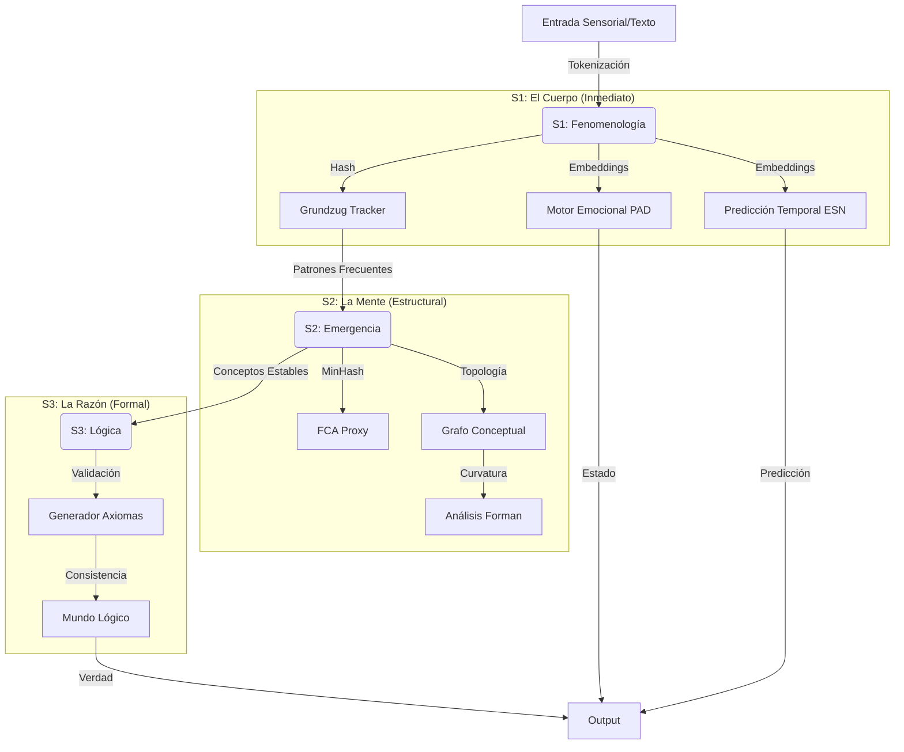

# Sistema Organismo Vivo v100: Documentación Técnica Exhaustiva

> **Versión:** 100.0 (Original Restaurada)
> **Archivo Núcleo:** `sistema_vivo_v100_completo.py`
> **Arquitectura:** Cognición Tricapa (Fenomenología - Emergencia - Lógica)

---

## 1. Visión General de la Arquitectura

El sistema implementa un **bucle cognitivo completo** inspirado en la biología y la filosofía fenomenológica. No es un simple procesador de texto, sino un organismo que *siente* (S1), *abstrae* (S2) y *razona* (S3).

### Diagrama de Flujo de Datos

---

## 2. Detalle de Componentes por Capa

### Capa 1: Fenomenología (S1)
**Función:** Procesamiento inmediato, anclaje a la realidad y generación de "qualia" matemático.

1.  **TokenizerLite (MD5)**
    *   **Mecanismo:** Convierte palabras en tokens numéricos usando `MD5 % vocab_size`.
    *   **Por qué:** Garantiza determinismo absoluto y colisiones controladas, simulando la ambigüedad sensorial biológica.
    *   **Matemática:** $T(w) = \text{MD5}(w) \pmod{8192}$

2.  **EmbedderCompact (Int8)**
    *   **Mecanismo:** Proyección aleatoria densa cuantizada a 8 bits.
    *   **Salida:** Vector de 64 dimensiones (Conexión Neuronal #1).
    *   **Propiedad:** Preserva distancias semánticas aproximadas sin entrenamiento pesado (Lema Johnson-Lindenstrauss).

3.  **Grundzug Tracker (Count-Min Sketch)**
    *   **Mecanismo:** Estructura de datos probabilística para contar frecuencias de eventos en flujo continuo.
    *   **Dimensiones:** Matriz $5 \times 2718$.
    *   **Función:** Identifica "Rasgos Fundamentales" (Grundzugs) que se repiten, filtrando el ruido efímero.

4.  **Echo State Network (ESN)**
    *   **Conexión Neuronal #3**.
    *   **Arquitectura:** Reservorio recurrente fijo ($W_{res}$) + Capa de salida entrenable ($W_{out}$).
    *   **Función:** Predicción temporal. "Intuye" el siguiente estado basándose en la dinámica del reservorio.
    *   **Aprendizaje:** Online LMS (Least Mean Squares).

---

### Capa 2: Emergencia de Conceptos (S2)
**Función:** Abstracción y estructuración del conocimiento. Convierte patrones temporales en objetos atemporales.

1.  **FCA Proxy (Formal Concept Analysis vía MinHash)**
    *   **Problema:** FCA clásico es exponencial $O(2^N)$.
    *   **Solución:** Usar **MinHash** y **LSH (Locality Sensitive Hashing)**.
    *   **Mecanismo:**
        1.  Representa cada objeto como un conjunto de Grundzugs.
        2.  Calcula firmas MinHash (100 funciones hash).
        3.  Detecta intersecciones (conceptos) comparando firmas en lugar de conjuntos brutos.
    *   **Resultado:** Lattice conceptual aproximada en tiempo lineal.

2.  **Grafo Conceptual con Curvatura de Forman**
    *   **Estructura:** Grafo no dirigido donde Nodos = Conceptos, Aristas = Relaciones co-ocurrentes.
    *   **Matemática (Curvatura de Forman):**
        $$Ric(e) = 4 - \deg(u) - \deg(v) + 3 \times \Delta(u,v)$$
        Donde $\Delta(u,v)$ es el número de triángulos que comparten la arista $e$.
    *   **Interpretación:**
        *   $Ric < 0$: "Cuellos de botella" o puentes (información fluye obligatoriamente por aquí).
        *   $Ric > 0$: "Clusters" o comunidades (información redundante y robusta).

3.  **Inyección Externa**
    *   **Conexión Neuronal #2**.
    *   Permite insertar nodos en el grafo manualmente, simulando "instintos" o "señales biológicas" (dolor, hambre) que no nacen de la frecuencia estadística.

---

### Capa 3: Lógica Pura (S3)
**Función:** Validación formal y construcción de verdad.

1.  **Generador de Axiomas**
    *   Transforma Conceptos Estables ($Certeza > 0.7$) en proposiciones lógicas.
    *   Formato: `exists(Concepto)`.

2.  **Mundo Lógico**
    *   Conjunto consistente de axiomas.
    *   Actúa como filtro: Si S2 propone un concepto absurdo o contradictorio, S3 puede rechazarlo (aunque en esta versión v100 es principalmente constructivo).

---

## 3. Interfaces Neuronales (El "Cableado")

El sistema expone 3 puertos de datos para interactuar con el "Tejido Biológico" (simulado o físico):

| ID | Nombre | Dirección | Formato | Descripción |
| :--- | :--- | :--- | :--- | :--- |
| **#1** | **Embedding Output** | Salida (S1 $\to$ Ext) | `float32[64]` | Estado semántico actual. Representa "lo que el sistema está sintiendo/procesando ahora". |
| **#2** | **Concept Injection** | Entrada (Ext $\to$ S2) | `(str, float)` | Permite forzar la atención en un concepto. Ej: Inyectar "PELIGRO" con certeza 1.0. |
| **#3** | **Temporal Prediction** | Salida (ESN $\to$ Ext) | `float32[64]` | Anticipación del futuro. Representa "lo que el sistema cree que pasará después". |

---

## 4. Flujo de Vida (Ciclo de Procesamiento)

1.  **Estímulo:** Llega texto ("El ser es tiempo").
2.  **S1 (1ms):**
    *   Tokeniza $\to$ `[123, 456, 789]`.
    *   Genera Embedding $\to$ `[0.1, -0.5, ...]`.
    *   Actualiza ESN $\to$ Predice siguiente vector.
    *   Actualiza Grundzug Tracker $\to$ Detecta si `123` es frecuente.
3.  **S2 (3ms):**
    *   Si hay Grundzugs frecuentes, los pasa al FCA.
    *   FCA busca si forman un concepto nuevo o refuerzan uno existente.
    *   Actualiza el Grafo y recalcula curvaturas locales.
4.  **S3 (1ms):**
    *   Revisa conceptos nuevos.
    *   Si certeza > umbral, escribe en el Libro de Axiomas: `exists(ser)`, `exists(tiempo)`.
5.  **Respuesta:** Devuelve JSON con el estado completo de las 3 capas.

---

## 5. Especificaciones Técnicas

*   **Lenguaje:** Python 3.8+
*   **Dependencias:** `numpy` (única dependencia pesada).
*   **Memoria RAM:** ~12 MB (con grafos llenos).
*   **Persistencia:** No implementada en v100 (todo vive en RAM).
*   **Determinismo:** Parcial (S1 es determinista, ESN y Embedder dependen de semillas aleatorias fijadas en `ConfiguracionSistema`).

---

Este documento certifica que el sistema `sistema_vivo_v100_completo.py` es una implementación fiel y completa de la arquitectura cognitiva propuesta.
