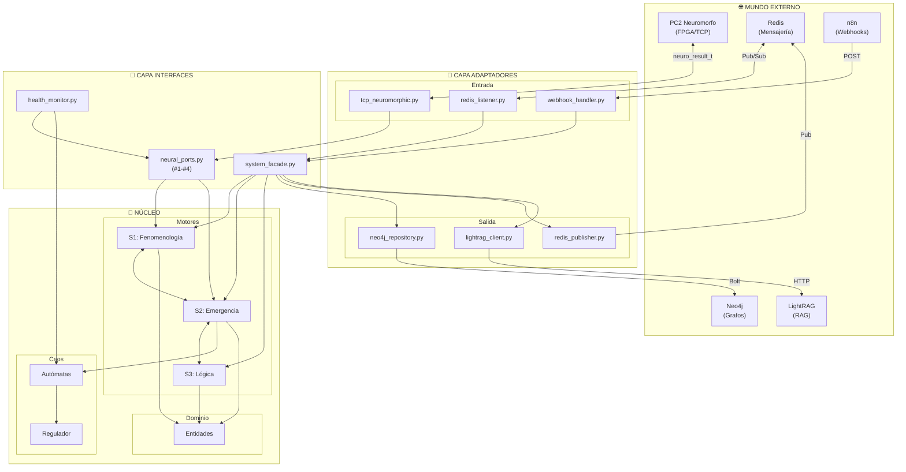
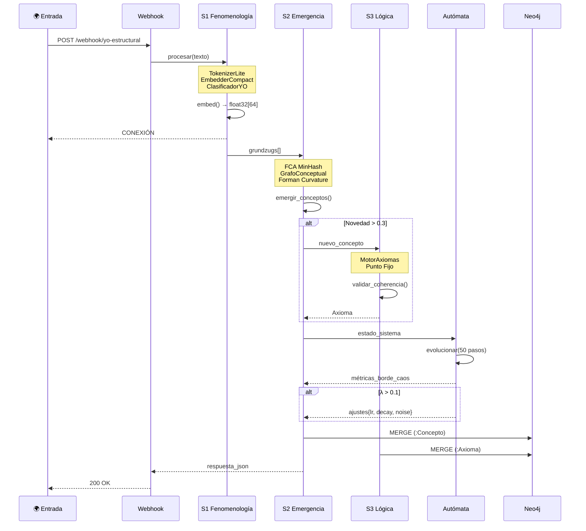
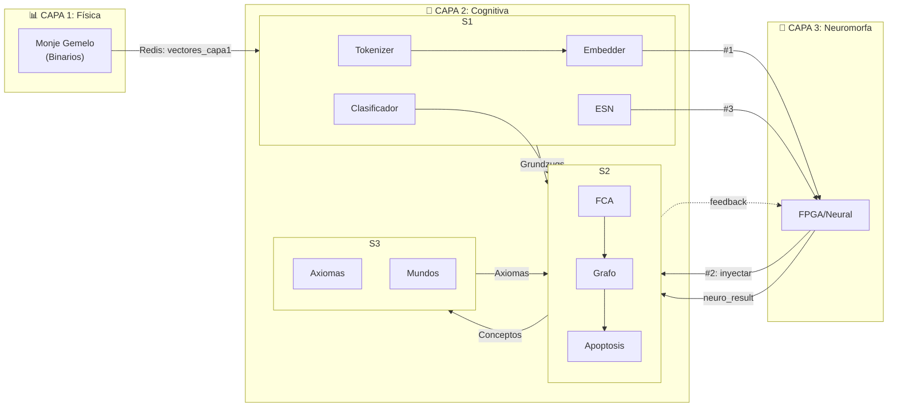
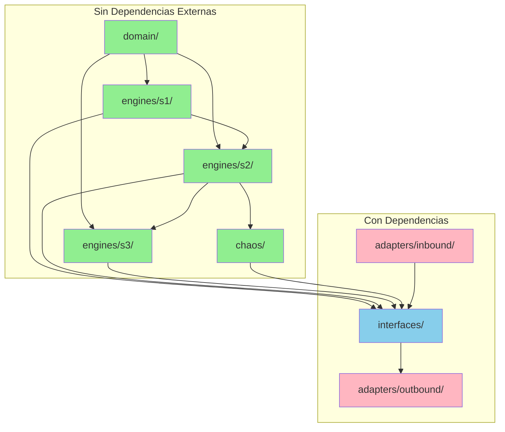

# 🏗️ Arquitectura Sistema Terminado - Diagrama Detallado

## 1. Vista General (Hexagonal/Onion)



---

## 2. Flujo de Datos Detallado



---

## 3. Estructura de Carpetas Propuesta

```
sistema_terminado/
│
├── 📁 core/                          # SIN DEPENDENCIAS EXTERNAS
│   │
│   ├── 📁 domain/                    # Entidades del dominio
│   │   ├── __init__.py
│   │   ├── concepto.py               # Concepto, ConceptoEmergente
│   │   ├── axioma.py                 # Axioma, Proposición
│   │   ├── grundzug.py               # Grundzug, TipoYO
│   │   ├── instancia.py              # Instancia, InstanciaAbstracta
│   │   └── configuracion.py          # ConfiguracionSistema
│   │
│   ├── 📁 engines/                   # Motores de procesamiento
│   │   │
│   │   ├── 📁 s1_fenomenologia/      # CAPA EMPÍRICA
│   │   │   ├── __init__.py
│   │   │   ├── tokenizer.py          # TokenizerLite
│   │   │   ├── embedder.py           # EmbedderCompact
│   │   │   ├── clasificador.py       # ClasificadorYO (SGD)
│   │   │   ├── grundzug_tracker.py   # Count-Min Sketch
│   │   │   ├── emotion_engine.py     # PAD Model
│   │   │   └── esn.py                # EchoStateNetwork
│   │   │
│   │   ├── 📁 s2_emergencia/         # CAPA EMERGENCIA
│   │   │   ├── __init__.py
│   │   │   ├── motor_emergencia.py   # Orquestador S2
│   │   │   ├── fca_processor.py      # FCA + MinHash + LSH
│   │   │   ├── grafo_conceptual.py   # Grafos + Curvatura
│   │   │   ├── mdce_manager.py       # Memory-Driven CE
│   │   │   └── apoptosis.py          # Muerte celular
│   │   │
│   │   └── 📁 s3_logica/             # CAPA LÓGICA
│   │       ├── __init__.py
│   │       ├── motor_axiomas.py      # Forward Chaining
│   │       ├── mundo_hipotetico.py   # Universo cerrado
│   │       └── logica_pura.py        # S3LogicaPura
│   │
│   └── 📁 chaos/                     # BORDE DEL CAOS
│       ├── __init__.py
│       ├── automata_1d.py            # Regla 110 + Langton
│       ├── automata_2d.py            # Game of Life + Gliders
│       ├── regulador.py              # Feedback cerrado
│       └── metricas.py               # Lyapunov, Entropía
│
├── 📁 adapters/                      # CONEXIONES EXTERNAS
│   │
│   ├── 📁 inbound/                   # Entrada al sistema
│   │   ├── __init__.py
│   │   ├── tcp_neuromorphic.py       # NeuralReceiver (PC2)
│   │   ├── redis_listener.py         # RedisMonjeConnector
│   │   └── webhook_handler.py        # HTTP entrada
│   │
│   └── 📁 outbound/                  # Salida del sistema
│       ├── __init__.py
│       ├── neo4j_repository.py       # Persistencia grafos
│       ├── redis_publisher.py        # Pub eventos
│       ├── lightrag_client.py        # RAG API
│       └── n8n_integrator.py         # Webhook salida
│
├── 📁 interfaces/                    # CONTRATOS PÚBLICOS
│   ├── __init__.py
│   ├── neural_ports.py               # Conexiones #1-#4
│   ├── system_facade.py              # Orquestador maestro
│   └── health_monitor.py             # HealthManager
│
├── 📁 config/
│   ├── settings.py                   # Pydantic Settings
│   ├── logging_config.py
│   └── .env.example
│
├── 📁 tests/
│   ├── test_s1.py
│   ├── test_s2.py
│   ├── test_s3.py
│   └── test_integration.py
│
├── 📁 docs/
│   ├── CATALOGO_CONEXIONES.md
│   ├── ARQUITECTURA.md
│   └── API.md
│
├── main.py                           # Punto de entrada
├── requirements.txt
└── README.md
```

---

## 4. Mapa de Conexiones por Capa



---

## 5. Conexiones Numeradas

| # | Nombre | Origen | Destino | Formato | Archivo |
|:--|:-------|:-------|:--------|:--------|:--------|
| **#1** | Embedding Out | S1.Embedder | Externo/PC2 | `float32[64]` | `embedder.py` |
| **#2** | Concept Inject | Externo/PC2 | S2.Motor | `(str, float)` | `motor_emergencia.py` |
| **#3** | Temporal Pred | S1.ESN | Externo/PC2 | `float32[64]` | `esn.py` |
| **#4** | Axioma Bridge | S2 | S3 | `Axioma` | `logica_pura.py` |
| **R1** | Redis In | Capa1 | S1 | JSON | `redis_listener.py` |
| **R2** | Redis Out | S2 | Capa1 | JSON | `redis_publisher.py` |
| **N1** | Neo4j Write | S2/S3 | DB | Cypher | `neo4j_repository.py` |
| **T1** | TCP Neuro | PC2 | S2 | `neuro_result_t` | `tcp_neuromorphic.py` |
| **W1** | Webhook In | n8n | Facade | HTTP POST | `webhook_handler.py` |
| **L1** | LightRAG | Facade | API | HTTP | `lightrag_client.py` |

---

## 6. Dependencias entre Módulos



**Verde** = Core puro (testeable sin mocks)  
**Rosa** = Adapters (requieren mocks)  
**Azul** = Interfaces (puente)
