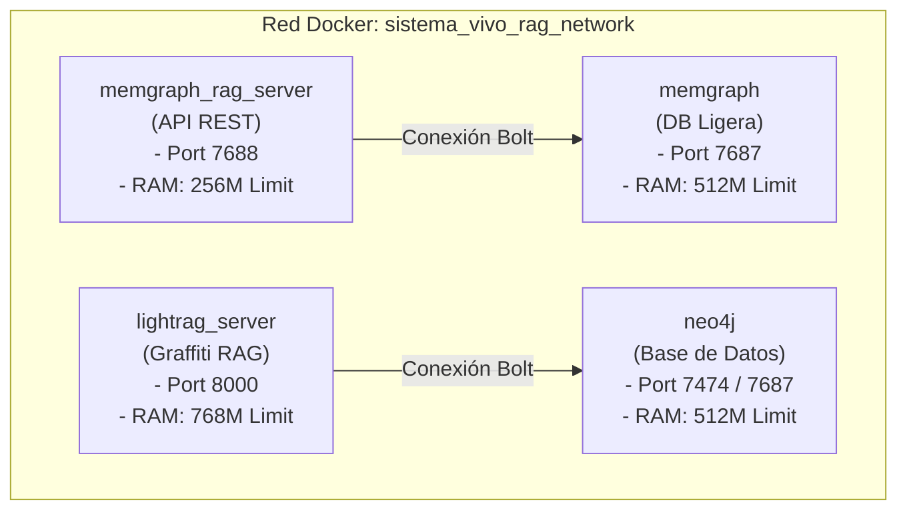

# 📋 Plan de Despliegue: Infraestructura RAG en Servidor DigitalOcean (1GB RAM)

Este plan detalla el procedimiento para instalar, configurar y optimizar el stack de **Memoria Cognitiva y RAG de Grafos** (excluyendo **n8n** por completo) en el VPS de DigitalOcean (`159.203.164.103`), asegurando que todos los servicios corran de forma estable gracias al swap de 4 GB.

---

## 🎨 Arquitectura del Sistema (Producción)

El stack se desplegará utilizando contenedores Docker en una red interna aislada. Para un entorno de 1 GB de RAM, se aplican límites de memoria quirúrgicos en cada base de datos y se utiliza la versión básica de Memgraph en lugar de Platform (eliminando la interfaz visual pesada de Memgraph Lab y herramientas de consola).



---

## 📊 Presupuesto de Memoria Virtual (RAM + Swap)

* **RAM Física Disponible:** 961 MiB
* **Swap Configurado:** 4.0 GiB (Total memoria virtual: ~5.0 GB)

| Servicio | Límite Asignado | Heap/Configuración | Rol |
| :--- | :--- | :--- | :--- |
| **`neo4j`** | 512 MB | Heap Max: 256M, Pagecache: 128M | Persistencia semántica |
| **`memgraph`** | 512 MB | Versión core `memgraph:latest` | PPR y Hechos relacionales |
| **`lightrag`** | 768 MB | 1 Uvicorn Worker | Embeddings locales (MiniLM) |
| **`memgraph_rag`**| 256 MB | Servidor Flask ligero | Pipeline RAG de grafos |
| **Kernel / OS** | 512 MB | swappiness=10 | Administración del host |
| **TOTAL ESTIMADO**| **~2.5 GB** | | **Sobra 2.5 GB de Swap para picos** |

---

## 🛠️ Procedimiento de Despliegue (Paso a Paso)

### 1. Preparación del Entorno Local (Codespace)

Para evitar saturar la CPU y memoria del VPS, compilaremos las imágenes personalizadas en el Codespace y las exportaremos en archivos comprimidos.

#### Paso 1.1: Crear el Docker Compose de Producción (`docker-compose.prod.yml`)
Crearemos el archivo sin el servicio de `n8n` y con los límites de memoria detallados.

#### Paso 1.2: Compilar y guardar `memgraph_rag_server`
```bash
# Construir la imagen del servidor RAG
docker build -f sincronizacion-obsidiane/docker/Dockerfile.memgraph_rag -t memgraph_rag_server:latest sincronizacion-obsidiane/

# Guardar la imagen local en un archivo comprimido
docker save memgraph_rag_server:latest | gzip > memgraph_rag.tar.gz
```
*(Nota: La imagen de `lightrag` ya se encuentra compilada y disponible en el archivo local `lightrag.tar.gz` de 600MB).*

---

### 2. Acondicionar el VPS (DigitalOcean)

#### Paso 2.1: Instalar Docker y Docker Compose
Dado que el droplet no cuenta con Docker, ejecutaremos el instalador oficial de conveniencia vía SSH:
```bash
ssh -i INFRA_BACKUP/id_ed25519 root@159.203.164.103 "curl -fsSL https://get.docker.com -o get-docker.sh && sh get-docker.sh"
```

#### Paso 2.2: Crear el directorio de despliegue
```bash
ssh -i INFRA_BACKUP/id_ed25519 root@159.203.164.103 "mkdir -p /root/sincronizacion-obsidiane/data"
```

---

### 3. Transferencia de Imágenes y Archivos al VPS

Copiaremos las imágenes comprimidas y las configuraciones necesarias desde el Codespace hacia el VPS usando `scp`:

```bash
# Transferir imágenes Docker
scp -i INFRA_BACKUP/id_ed25519 lightrag.tar.gz root@159.203.164.103:/root/lightrag.tar.gz
scp -i INFRA_BACKUP/id_ed25519 memgraph_rag.tar.gz root@159.203.164.103:/root/memgraph_rag.tar.gz

# Transferir configuración del compose y archivos necesarios
scp -i INFRA_BACKUP/id_ed25519 sincronizacion-obsidiane/docker-compose.prod.yml root@159.203.164.103:/root/sincronizacion-obsidiane/docker-compose.yml
scp -i INFRA_BACKUP/id_ed25519 sincronizacion-obsidiane/lightrag_custom_server.py root@159.203.164.103:/root/sincronizacion-obsidiane/lightrag_custom_server.py
```

---

### 4. Lanzar y Validar en el VPS

Una vez que los archivos estén en el VPS:

#### Paso 4.1: Cargar las imágenes en el demonio Docker del VPS
```bash
ssh -i INFRA_BACKUP/id_ed25519 root@159.203.164.103 "gunzip -c /root/lightrag.tar.gz | docker load"
ssh -i INFRA_BACKUP/id_ed25519 root@159.203.164.103 "gunzip -c /root/memgraph_rag.tar.gz | docker load"
```

#### Paso 4.2: Iniciar el stack de servicios
```bash
ssh -i INFRA_BACKUP/id_ed25519 root@159.203.164.103 "cd /root/sincronizacion-obsidiane && docker compose up -d"
```

#### Paso 4.3: Validar estado de salud y recursos
```bash
# Verificar contenedores corriendo
ssh -i INFRA_BACKUP/id_ed25519 root@159.203.164.103 "docker ps"

# Comprobar el uso de RAM y Swap
ssh -i INFRA_BACKUP/id_ed25519 root@159.203.164.103 "free -h"
```

---

## 🔒 Variables de Entorno Requeridas

Antes de levantar el stack en el VPS, deberemos transferir o inyectar las claves de la API en el archivo `/root/sincronizacion-obsidiane/.env` del VPS:
* `GOOGLE_GEMINI_API_KEY`
* `GROQ_API_KEY`
* `NEO4J_PASSWORD=fenomenologia2024`
* `LIGHTRAG_API_KEY=your_api_key_default`
